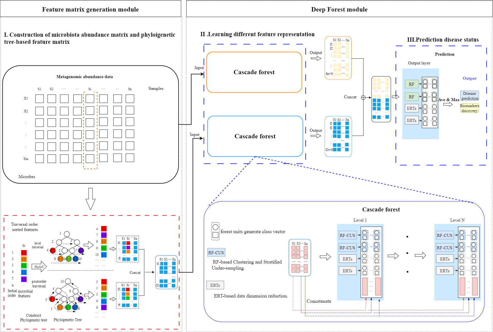

# MicroHDF : predicting host phenotypes with metagenomic data using a deep forest-based framework

The accurate classification of host phenotypes based on microbiome data with machine learning (ML) methods has attracted a lot of attention recently. However, decreased accuracy and poor generalisation are widespread in the host phenotype prediction task owing to metagenomic data with a low sample size, class imbalance, and high-dimensional features, etc. To address these factors of impacted model prediction, we propose MicroHDF, a novel interpretable deep learning framework utilizing ensemble cascade layers composed of various deep forest units to tackle these challenges. 


## Framework of MicroHDF

Our framework follows a three-step procedure: 
- (i) construction of the microbial abundance matrix and phylogenetic tree-based feature matrix to facilitate proper learning; 
- (ii) utilisation of deep forest units to learn different feature representations; 
- (iii) utilisation of class distributions to make predictions.

 

-------------------------------------

## Installation

#### Dependencies:</BR>

>* scikit-bio = 0.6.2

>* python = 3.8

>* scikit-learn = 1.3.2

>* pandas = 2.0.3

>* joblib = 1.4.2

>* lefse = 1.1.2

yon can install the  version of  MicroHDF via [Anaconda](https://anaconda.org/) with:</BR>

``` python
git clone https://github.com/glutBiolab/MicroHDF.git

cd MicroHDF

conda env create -f environment.yaml

conda activate MicroHDF

python multi_channel_main.py
``` 
-------------------------


## Usage


### 1. Input data (Feature abundance table and metadata)

To use MicroHDF, you need to provide microbial abundance profile (csv format), metadata.

#### Format of abundance table:

⚠️**Importantly, the input abundance table should include hierarchical level information.**

- The rownames are samples.
- <div class="long-text">The colnames are feature (e.g.k__Archaea|p__Euryarchaeota|c__Methanobacteria|o__Methanobacteriales|f__Methanobacteriaceae|g__Methanobrevibacter s__Methanobrevibacter_smithii).</div>
- The abundance value can be read counts or normalized values .

An example code tailored for a microbial abundance table is as follows:

| sampleID          |s__Methanobrevibacter_smithii | ...     |
|--------------|------------|------------|
| HD-10 |0.0654  |...   |
| HD-11|0.0   |...   |
| HD-12  |0.06806  |...   |

#### Format of metadata table:

- The rownames are samples, columns are groups.
- The grouping variable can be categories (normal or disease ).

| sampleID     |disease  | ...     |
|--------------|------------|------------|
| HD-10 |0 |...   |
| HD-11|1  |...   |
| HD-12  |1   |...   |

### 2. Build phylogenetic tree information

- We obtained a phylogenetic tree using Newick and generated PhyIoT using the method provided in ETE3. The phylo_feature.py provides a set of processes for running code. It extracts the phylogenetic relationship information of taxa by performing level-order traversal and post-order traversal on the nodes of the tree.

 ``` python
python phylo_feature.py
```

The result is a phylogenetic tree matrix.<br/>

|      |239935  | ...     |
|--------------|------------|------------|
|1|0.0034 |...   |
| 2|8.52552 |...   |
| 3  |0.00481   |...   |


### 3. Run MicroDF


#### Use MicroHDF to classify disease status for input samples

 Apply MicroHDF to classify the disease status of your test samples.


`
python multi_channel_main.py -i <Input_file> -d <disease>
`<BR/>
(Note: `<disease>` refers to the name of disease in the column "disease" of input matrix. For example, `-d Cirrhosis`, `-d IBD`, etc. )

#### Full command-line options
`python multi_channel_main.py -h`<BR/>
```
  optional arguments:
    -h, --help                    Show help message and exit.
    -i, --input_file              The directory of input csv file.
    -d, --disease                 The name of the disease.
    -dp, --damping                The value of damping in APCluster.(default: 0.5)
    -mi, --max_iter               The value of max_iter in APCluster.(default: 50)
    -ci, --convergence_iter       The value of convergence_iter in APCluster.(default: 25)
    -c, --cvfold                  The value of k in k-fold cross validation.(default: 5)
    -p, --simi_type               The value simi_type represents two methods of similarity: braycurtis and distance similarity (default: distance similarity).
    -k, --kmeans                  The value kmeans stands for the number of K-means clusters.(default: 5)
    -rcr, --run_cluster_resample  Whether run cluster and resample process.If set to 1, then will add the process. (default: run)
    -s, --select_feature          The value select_feature stands for the way features are filtered.  (default: 1)
    -ct, --cluster_type           The value cluster_type represents the sampling method: We provide two sampling methods: probabilistic and proportional.  (default: proportional)
```

#### Batch effect removeing
- We used the MMUPHin package for batch effect processing. MMUPHin is an R package for meta-analysis tasks of microbiome cohorts. 

 ```R
Rscript Batcheffect_removed.R
 ```


#### 

## Contact

If you have any questions, please directed to the corresponding authors : 471745950@qq.com 

